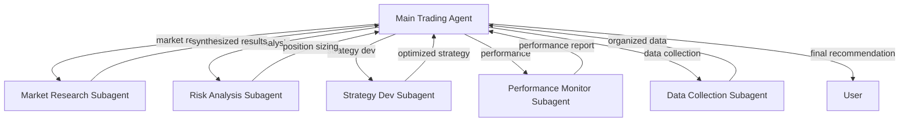

# 🤖 Polymarket Subagent System

A sophisticated multi-agent architecture that solves **context bloat** while enabling complex trading analysis workflows.

## 🎯 The Problem: Context Bloat

Traditional agents suffer from **context bloat**:
- Complex analysis fills up token windows with intermediate results
- Main agent loses focus on high-level coordination
- Error-prone multi-step workflows
- Hard to maintain specialized capabilities

## 🚀 The Solution: Specialized Subagents

Our subagent system delegates specialized work to focused agents while keeping the main agent context clean and focused on coordination.



## 📋 Available Subagents

### 1. 🧠 Market Research (`market-research`)
**Purpose**: In-depth market analysis and intelligence gathering

**Capabilities**:
- Find related markets in our 20K+ database
- Analyze market trends and momentum
- Research market context and relationships
- Provide detailed market intelligence

**Use When**: "Research the Russia-Ukraine ceasefire market trends"

### 2. 📊 Risk Analysis (`risk-analysis`)
**Purpose**: Portfolio risk assessment and position sizing

**Capabilities**:
- Calculate Kelly Criterion position sizes
- Assess portfolio concentration risk
- Evaluate market-specific risks (liquidity, volatility)
- Provide risk management recommendations

**Use When**: "Calculate position size for a 2% edge trade"

### 3. 🎯 Strategy Development (`strategy-dev`)
**Purpose**: Strategy creation, optimization, and backtesting

**Capabilities**:
- Analyze strategy performance metrics
- Optimize parameters for better returns
- Create strategies from market analysis
- Backtest strategies against historical data

**Use When**: "Optimize my current strategy parameters"

### 4. 📈 Performance Monitor (`performance-monitor`)
**Purpose**: Trading performance tracking and system health

**Capabilities**:
- Generate comprehensive performance reports
- Analyze portfolio exposure and concentration
- Monitor system health and metrics
- Provide performance improvement recommendations

**Use When**: "Generate monthly performance report"

### 5. 📊 Data Collection (`data-collection`)
**Purpose**: Market data gathering and organization

**Capabilities**:
- Collect market data by search criteria
- Gather intelligence on specific markets
- Analyze patterns across categories
- Assess data quality and completeness

**Use When**: "Gather crypto market data above $1M volume"

## 🏗️ Architecture Benefits

### Context Efficiency
- **Main Agent**: ~150 tokens (clean, focused)
- **Without Subagents**: ~1,050+ tokens (bloated, unfocused)
- **Savings**: 85% reduction in context usage

### Specialization
- Each subagent has domain-specific expertise
- Focused tool sets prevent capability dilution
- Better error isolation and debugging

### Scalability
- Easy to add new specialized capabilities
- Independent development and testing
- Modular architecture for growth

## 🚀 Quick Start

### Installation
```bash
pip install deepagents  # Required for subagent functionality
```

### Basic Usage
```python
from deepagents import create_deep_agent
from agents.subagents import get_all_subagents

# Create main agent with subagents
agent = create_deep_agent(
    model="claude-sonnet-4-5-20250929",
    system_prompt="You are a sophisticated trading agent. Use subagents for complex tasks.",
    subagents=get_all_subagents()
)

# The agent can now delegate complex work
response = agent.run("Analyze the Russia-Ukraine market and recommend a trade")
```

### Manual Subagent Testing
```python
from agents.subagents import create_market_research_subagent

# Test individual subagent
research_config = create_market_research_subagent()
print("Subagent config:", research_config)
```

## 📝 Subagent Configuration

Each subagent follows the deepagents specification:

```python
{
    "name": "unique-identifier",
    "description": "What it does (for main agent decision-making)",
    "system_prompt": "Detailed instructions for the subagent",
    "tools": [tool_function1, tool_function2],
    "model": "optional-override-model"
}
```

### Key Configuration Principles

1. **Clear Descriptions**: Main agent uses descriptions to choose subagents
2. **Focused Tool Sets**: Only include necessary tools
3. **Detailed Prompts**: Include output format requirements
4. **Concise Outputs**: Instruct subagents to summarize, not dump data

## 🔄 Workflow Examples

### Complex Trading Analysis
```
User Query: "Should I trade the Super Bowl market?"

Main Agent:
├── Delegates to market-research: "Research NFL market trends"
├── Delegates to risk-analysis: "Assess position sizing"
├── Delegates to strategy-dev: "Validate against strategy rules"
└── Synthesizes results into final recommendation
```

### Performance Review
```
User Query: "How am I doing this month?"

Main Agent:
├── Delegates to performance-monitor: "Generate monthly report"
├── Delegates to risk-analysis: "Analyze current exposure"
└── Provides comprehensive performance summary
```

### Strategy Optimization
```
User Query: "My win rate is only 50%, help me improve"

Main Agent:
├── Delegates to performance-monitor: "Analyze current performance"
├── Delegates to strategy-dev: "Suggest parameter optimizations"
├── Delegates to risk-analysis: "Review risk management"
└── Provides integrated improvement plan
```

## 🛠️ Development & Testing

### Testing Individual Subagents
```python
from agents.subagents.market_research import search_related_markets

# Test market search tool
results = search_related_markets("bitcoin price")
print(f"Found {len(results)} related markets")
```

### Running the Demo
```bash
python subagent_demo.py
```

### Integration Testing
```python
from market_analysis_workflow import MarketAnalyzer
from agents.subagents import create_risk_analysis_subagent

# Test subagent with real data
analyzer = MarketAnalyzer()
risk_subagent = create_risk_analysis_subagent()

# Simulate subagent workflow
market_analysis = analyzer.analyze_market_opportunity("Russia x Ukraine ceasefire in 2025?")
# In real usage, this would be passed to the risk subagent
```

## 📊 Performance Monitoring

### Context Usage Tracking
Monitor how subagents reduce context bloat:
- Track main agent context size before/after subagent adoption
- Measure response quality vs context efficiency
- Monitor subagent delegation success rates

### Quality Metrics
- Subagent response relevance and completeness
- Main agent coordination effectiveness
- Overall workflow success rates

## 🔧 Customization

### Adding New Subagents
1. Create `agents/subagents/new_specialty.py`
2. Implement specialized tools and logic
3. Add to `agents/subagents/__init__.py`
4. Test integration with main agent

### Modifying Existing Subagents
- Update system prompts for better performance
- Add/remove tools based on needs
- Adjust model specifications for different tasks
- Refine output formats for better integration

## 🚨 Best Practices

### Subagent Design
- **Single Responsibility**: Each subagent has one clear purpose
- **Clear Boundaries**: Well-defined when to use each subagent
- **Consistent Outputs**: Standardized response formats
- **Error Handling**: Graceful failure modes

### Main Agent Coordination
- **Clear Delegation**: Explicitly state what to delegate and why
- **Result Synthesis**: Effectively combine subagent outputs
- **Fallback Handling**: Handle subagent failures gracefully
- **Context Management**: Keep main context focused on coordination

### System Architecture
- **Modular Design**: Easy to add/remove/replace subagents
- **Version Control**: Track subagent performance over time
- **Monitoring**: Comprehensive logging and metrics
- **Testing**: Isolated testing for each subagent

## 📈 Advanced Features

### Conditional Delegation
Main agent can make intelligent delegation decisions:
```python
# Simple query → handle directly
# Complex analysis → delegate to research subagent
# Risk calculation → delegate to risk subagent
```

### Chained Subagents
Subagents can delegate to other subagents for complex workflows:
```python
# Strategy subagent delegates data collection to data subagent
# Research subagent delegates risk assessment to risk subagent
```

### Dynamic Subagent Selection
Main agent chooses subagents based on query analysis:
```python
if "risk" in query: delegate_to = "risk-analysis"
if "performance" in query: delegate_to = "performance-monitor"
```

## 🎯 Real-World Impact

### Before Subagents
- ❌ Context limits complex analysis
- ❌ Main agent overwhelmed with details
- ❌ Error-prone multi-step workflows
- ❌ Hard to add specialized capabilities

### After Subagents
- ✅ Clean, focused main agent context
- ✅ Specialized agents for complex tasks
- ✅ Reliable multi-step workflows
- ✅ Easy to extend with new capabilities
- ✅ Better error isolation and debugging

## 🔗 Integration with Existing Systems

The subagent system integrates seamlessly with your existing:
- **Market Analysis Workflows** (`market_analysis_workflow.py`)
- **Backend Persistence** (`agents/backends/`)
- **LangGraph Agents** (`agents/graph/`)
- **Real Polymarket Data** (20K+ markets)

## 🚀 Getting Started

1. **Install deepagents**: `pip install deepagents`
2. **Review subagents**: `python subagent_demo.py`
3. **Test integration**: Use with your existing agents
4. **Monitor performance**: Track context usage and quality
5. **Extend system**: Add custom subagents for your needs

---

**Your Polymarket agents now have superpowers!** 🎉

Subagents enable sophisticated analysis while keeping your main agent lean, focused, and scalable. The context bloat problem is solved, and complex multi-step workflows are now manageable and reliable.
