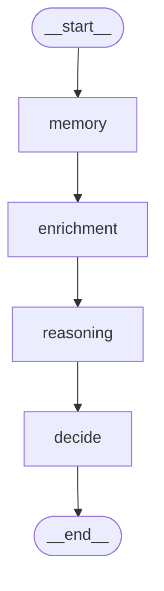

# Memory Agent Graph

```mermaid
flowchart TD
    __start__([__start__])
    memory[memory]
    enrichment[enrichment]
    reasoning[reasoning]
    decide[decide]
    __end__([__end__])

    __start__ --> memory
    decide --> __end__
    enrichment --> reasoning
    memory --> enrichment
    reasoning --> decide
```
