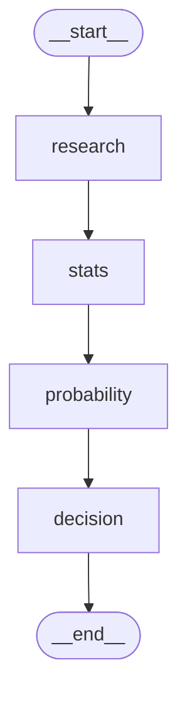

# Planning Agent Graph

```mermaid
flowchart TD
    __start__([__start__])
    research[research]
    stats[stats]
    probability[probability]
    decision[decision]
    __end__([__end__])

    __start__ --> research
    decision --> __end__
    probability --> decision
    research --> stats
    stats --> probability
```
